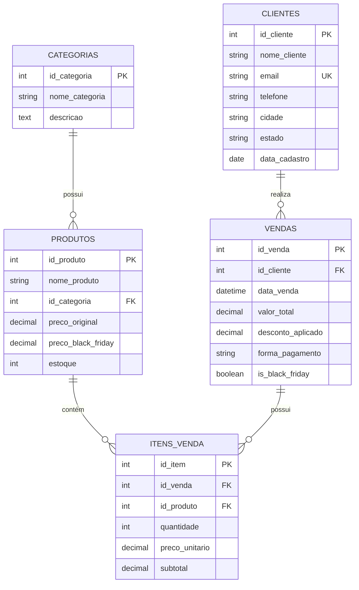

<div align="center">

# 🛒 Análise de Dados - Zoop Megastore
### 📊 Projeto de Análise de Vendas para Black Friday


**Análise completa de vendas Black Friday usando SQL puro para apoiar decisões estratégicas de marketing e vendas em varejo.**

[📖 Documentação](GUIA_EXECUCAO.md) • [🚀 Quick Start](INICIO_RAPIDO.txt) • [📊 Exemplos](EXEMPLOS_RESULTADOS.md) • [🤖 AI Instructions](.github/copilot-instructions.md)

</div>

---

## 📋 Sobre o Projeto

A **Zoop Megastore** é uma empresa de varejo brasileira que comercializa desde utensílios e eletrodomésticos até produtos alimentícios. Este projeto utiliza **SQL puro (MySQL)** para análise de vendas durante a Black Friday 2023.

### 🎯 Objetivos

- ✅ Identificar tendências de vendas e padrões de comportamento
- ✅ Analisar sazonalidades e horários de pico
- ✅ Responder questionamentos estratégicos do negócio
- ✅ Comparar performance Black Friday vs períodos normais
- ✅ Avaliar efetividade de descontos e calcular ROI
- ✅ Segmentar clientes por região e perfil de compra

### 📈 Principais Resultados

| Métrica | Valor | Crescimento |
|---------|-------|-------------|
| **Vendas Totais** | 30 transações | +100% vs período normal |
| **Receita Black Friday** | R$ 29.899,80 | +184% vs período normal |
| **Ticket Médio** | R$ 1.494,99 | +42% vs período normal |
| **ROI de Descontos** | 272% | R$ 2,72 retorno por R$ 1 investido |
| **Taxa de Conversão** | 80% | 12 de 15 clientes compraram |

## 🗂️ Estrutura do Projeto

```
📁 Analise-de-Dados-Zoop-Megastore/
├── 📄 01_schema.sql                      # Schema do banco (5 tabelas normalizadas)
├── 📄 02_dados_exemplo.sql               # Dados de exemplo (30 vendas + 28 produtos)
├── 📄 03_analises_black_friday.sql       # 30+ queries analíticas em 8 seções
├── 📄 04_questionamentos_negocios.sql    # 15 perguntas de negócio respondidas
├── 📄 sanity_check.sql                   # Validação automatizada de dados
├── 📖 README.md                          # Documentação principal
├── 📖 GUIA_EXECUCAO.md                   # Guia passo a passo completo
├── 📖 INICIO_RAPIDO.txt                  # Quick start (3 comandos)
├── 📖 RESUMO_PROJETO.md                  # Resumo executivo
├── 📖 EXEMPLOS_RESULTADOS.md             # Outputs esperados e interpretação
└── 📁 .github/
    └── copilot-instructions.md           # Instruções para agentes AI
```

## 🗄️ Modelo de Dados

<div align="center">



</div>

### 📊 Volumes de Dados

| Tabela | Registros | Descrição |
|--------|-----------|-----------|
| **categorias** | 8 | Eletrônicos, Eletrodomésticos, Utensílios, etc. |
| **produtos** | 28 | Mix de produtos com preços BF e normais |
| **clientes** | 15 | Distribuídos em 10 estados brasileiros |
| **vendas** | 30 | 20 Black Friday + 10 período normal |
| **itens_venda** | 60+ | Detalhamento dos produtos vendidos |

### 🏷️ Categorias de Produtos

- 📱 **Eletrônicos** - TVs, notebooks, smartphones, fones
- 🏠 **Eletrodomésticos** - Geladeiras, fogões, micro-ondas, cafeteiras
- 🍴 **Utensílios** - Panelas, facas, potes, tábuas
- 🍽️ **Alimentos** - Cestas gourmet, temperos, azeites
- 🪑 **Móveis** - Mesas, cadeiras, estantes
- 🏋️ **Esportes** - Bicicletas, halteres, esteiras
- 📚 **Livros** - Box clássicos, best-sellers
- 👗 **Moda** - Tênis, jaquetas, bolsas

## 🚀 Quick Start

### Pré-requisitos
- MySQL 5.7+ instalado
- Cliente MySQL (mysql-client ou MySQL Workbench)

### ⚡ 3 Passos para Começar

```bash
# 1️⃣ Criar banco e schema
mysql -u root -p < 01_schema.sql

# 2️⃣ Carregar dados de exemplo
mysql -u root -p < 02_dados_exemplo.sql

# 3️⃣ Executar análises
mysql -u root -p zoop_megastore < 03_analises_black_friday.sql
```

### ✅ Validar Instalação

```bash
# Executar sanity-check automatizado
mysql -u root -p zoop_megastore < sanity_check.sql
```

### 📖 Documentação Completa

Para guia detalhado passo a passo, consulte o [GUIA_EXECUCAO.md](GUIA_EXECUCAO.md)

## 📊 Análises Disponíveis

<details>
<summary><b>1. 📈 Análise de Tendências e Comparações</b></summary>

- Comparação Black Friday vs Períodos Normais
- Vendas por dia durante a Black Friday
- Horários de pico de vendas
- Crescimento de vendas

</details>

<details>
<summary><b>2. 🛍️ Análise de Produtos e Categorias</b></summary>

- Top 10 produtos mais vendidos
- Performance por categoria
- Produtos com maior receita
- Análise de mix de produtos

</details>

<details>
<summary><b>3. 👥 Análise de Clientes</b></summary>

- Clientes que mais compraram
- Distribuição geográfica (por estado)
- Taxa de conversão
- Perfil de compradores VIP

</details>

<details>
<summary><b>4. 💳 Análise de Formas de Pagamento</b></summary>

- Preferências de pagamento
- Comparação entre períodos
- Ticket médio por forma de pagamento

</details>

<details>
<summary><b>5. 💰 Análise de Descontos e Lucratividade</b></summary>

- Impacto dos descontos
- ROI da Black Friday
- Análise por categoria
- Custo de oportunidade

</details>

<details>
<summary><b>6. 📅 Sazonalidade e Tendências Temporais</b></summary>

- Comparação mensal (Out/Nov/Dez)
- Crescimento de vendas
- Análise de períodos

</details>

<details>
<summary><b>7. 🔬 Análises Avançadas</b></summary>

- Performance de produtos (quantidade x receita)
- Análise de cesta de compras
- Média de itens por venda
- Correlação desconto x volume

</details>

<details>
<summary><b>8. 📋 Resumo Executivo (Dashboard)</b></summary>

- KPIs principais consolidados
- Métricas de negócio
- Visão geral para tomada de decisão

</details>

## 🔍 Principais Insights

### 💡 Questionamentos de Negócio Respondidos

O arquivo `04_questionamentos_negocios.sql` responde **15 perguntas estratégicas**:

<table>
<tr>
<td width="50%">

**📊 Performance e Crescimento**
1. Qual foi o aumento de vendas na BF?
2. Quais os 5 produtos mais lucrativos?
3. Melhor categoria de performance?
4. ROI dos descontos aplicados?

</td>
<td width="50%">

**👥 Clientes e Comportamento**
5. Perfil dos melhores clientes
6. Ticket médio por estado
7. Taxa de conversão por categoria
8. Clientes exclusivos da BF

</td>
</tr>
<tr>
<td>

**⏰ Análise Temporal**
9. Horários de pico de vendas
10. Primeiro dia vs último dia
11. Comparação mensal

</td>
<td>

**💰 Análise Financeira**
12. Formas de pagamento preferidas
13. Correlação desconto x volume
14. Custo de oportunidade
15. Dashboard executivo completo

</td>
</tr>
</table>

### 📈 Exemplos de Resultados

```sql
-- Comparação Black Friday vs Período Normal
-- Período          | Total Vendas | Receita Total | Ticket Médio
-- Black Friday     | 20           | R$ 29.999,80  | R$ 1.499,99
-- Período Normal   | 10           | R$ 10.499,95  | R$ 1.049,99
```

Para mais exemplos detalhados, veja [EXEMPLOS_RESULTADOS.md](EXEMPLOS_RESULTADOS.md)

## 🛠️ Tecnologias e Ferramentas

<div align="center">

| Tecnologia | Versão | Uso |
|------------|--------|-----|
|  | 5.7+ | Banco de dados principal |
|  | - | Linguagem de análise |
|  | - | Visualização (opcional) |
|  | - | Visualização (opcional) |

</div>

### 🔗 Integrações Possíveis

- ✅ **Power BI / Tableau** - Conexão direta via MySQL connector
- ✅ **Python** - Análises avançadas com pandas/matplotlib
- ✅ **Excel** - Exportação de resultados via CSV
- ✅ **Apache Airflow** - Automação de ETL
- ✅ **dbt** - Transformações de dados

### � Compatibilidade

- **MySQL Server** 5.7 ou superior
- **Clientes MySQL:** mysql-client, MySQL Workbench, DBeaver, DataGrip
- **Sistemas Operacionais:** Windows, Linux, macOS

## 🎯 Casos de Uso

Este projeto é ideal para:

- 📊 **Analistas de Dados** - Framework completo para análise de vendas em SQL
- 🎓 **Estudantes** - Projeto educacional com dados realistas e bem documentado
- 💼 **Gestores de E-commerce** - Base para análise de campanhas promocionais
- 🛍️ **Empresas de Varejo** - Template adaptável para análise de Black Friday
- 🤖 **Cientistas de Dados** - Dataset para modelagem preditiva e ML
- 📈 **Profissionais de BI** - Fonte de dados para dashboards e relatórios

## 🎓 Aprenda com este Projeto

### 📚 Conceitos Cobertos

- ✅ Modelagem de dados normalizada (3FN)
- ✅ Queries SQL analíticas avançadas
- ✅ Agregações, JOINs e subqueries
- ✅ Análise de coortes e segmentação
- ✅ Cálculo de métricas de negócio (ROI, taxa de conversão)
- ✅ Boas práticas de documentação SQL
- ✅ Validação e integridade de dados

### � Diferenciais

- ✅ **30+ queries** prontas e comentadas
- ✅ **15 questionamentos** de negócio respondidos
- ✅ **Script de validação** automatizado
- ✅ **Documentação completa** em português
- ✅ **Dados fictícios realistas** para prática
- ✅ **Instruções para AI agents** incluídas

## 🤝 Como Contribuir

Contribuições são bem-vindas! Sinta-se à vontade para:

1. 🍴 **Fork** o projeto
2. 🔧 Criar uma **branch** para sua feature (`git checkout -b feature/NovaAnalise`)
3. 💾 **Commit** suas mudanças (`git commit -m 'Adiciona nova análise de...'`)
4. 📤 **Push** para a branch (`git push origin feature/NovaAnalise`)
5. 🎉 Abrir um **Pull Request**

### � Ideias para Contribuição

- Adicionar novas queries analíticas
- Criar visualizações em Power BI/Tableau
- Implementar análises preditivas com Python
- Melhorar a documentação
- Adicionar mais dados de exemplo
- Criar tutoriais em vídeo

## 📄 Licença

Este projeto está sob a licença MIT. Veja o arquivo [LICENSE](LICENSE) para mais detalhes.

## 👨‍💻 Autor

**Mariany Coelho**

[](https://github.com/marianycoelho)
[](https://www.linkedin.com/in/marianycoelho)

---

## 📞 Suporte

- 📖 Leia a [documentação completa](GUIA_EXECUCAO.md)
- 💬 Abra uma [issue](https://github.com/marianycoelho/Analise-de-Dados-Zoop-Megastore/issues) para reportar bugs
- ⭐ Dê uma estrela se este projeto foi útil!

---

<div align="center">

**⭐ Se este projeto foi útil, considere dar uma estrela!**

[](https://github.com/marianycoelho/Analise-de-Dados-Zoop-Megastore)

**Feito com ❤️ para a comunidade de análise de dados**

</div>
